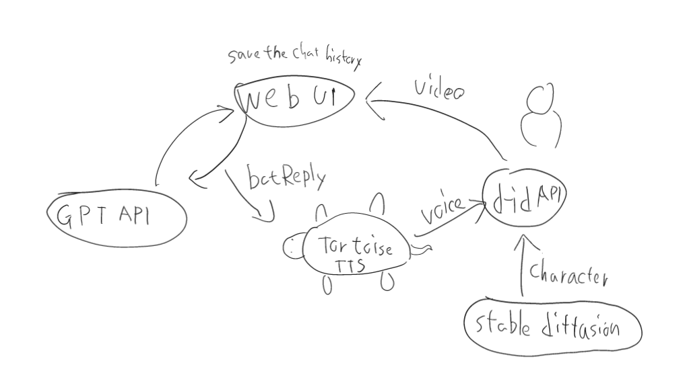

# write by ChatGPT and Bing ai
# Talk-With-Chat-GPT-WebUI
Talk-With-Chat-GPT-WebUI is a web application that utilizes OpenAI’s GPT model to simulate a chatbot conversation with users. The chatbot can respond to user input and continue the conversation using natural language processing.

##  To-do List

- [x] Use ChatGPT API in this web application 

    - [ ] let chat bot remember the chat 🤷‍♀️(idk it work or not now(testing))

- [x] Create a website to host the chatbot 

    - [x] let user set the chat log font size

    - [ ] show all previous chat 

- [ ] Implement sound for the chatbot using Tortoise TTS 🤔(trying)

    -[ ] make the custom voice🤔

- [ ] Use D-ID API video and display it on the web 😒(it need to buy to use api💸💸💸, 😢have any like that and free?)

## Usage
To use Talk-With-Chat-GPT-WebUI,

1. Download or clone the project to your local machine by running the following command in a terminal:

        git clone https://github.com/salire123/talk-with-chat-gpt-webui.git

2. Create a .env file with the following configuration:

        OPENAI_API_KEY=<your OpenAI API key>
        MESSAGE_LOG_PATH=message_log/testing_message_log.txt

    Replace <your OpenAI API key> with your actual OpenAI API key, which you can find on the OpenAI platform website under "API Keys".

    The MESSAGE_LOG_PATH variable specifies the file path and name for the message log file. The example specifies a file named testing_message_log.txt located in a directory named message_log.

3. Install the required packages from requirements.txt by running the following command in a terminal:

        pip install -r requirements.txt

4. Run the app.py file by running the following command in a terminal:

        python app.py

5. Open http://localhost:5000/ in your browser to enter the web interface.

6. Start chatting with the ChatGPT model.👍

By following these steps, you should be able to run the "talk-with-chat-gpt-webui" project and chat with the ChatGPT model through a web interface. The conversation will be logged in the message log file specified in the .env file.

##  Dependencies
Talk-With-Chat-GPT-WebUI relies on the following dependencies:

ChatGPT API: A Python wrapper for OpenAI’s GPT model that allows easy integration with web applications.
Tortoise TTS: A text-to-speech library that converts text into natural sounding speech using deep learning models.
D-ID API: A face anonymization service that generates realistic videos of faces without revealing their identity.

# ---------------------------------------------------------
# 做完才寫中文
# Talk-With-Chat-GPT-WebUI

Talk-With-Chat-GPT-WebUI是一個使用Python和Flask開發的網頁介面，讓使用者可以與ChatGPT模型進行對話。

## 安裝和使用

1. 下載或克隆本專案到本地。
2. 安裝requirements.txt中所需的套件。
3. 執行app.py檔案。
4. 在瀏覽器中打開http://localhost:5000/進入網頁介面。
5. 開始與ChatGPT模型對話。

## 貢獻者和授權

本專案是由[貢獻者姓名]開發和維護的。本專案採用[授權名稱]授權，詳情請參閱LICENSE檔案。

## 聯絡方式和回饋方式

如果您有任何問題、建議或錯誤回報，請聯絡[聯絡方式]或在GitHub上提交issue或pull request。
